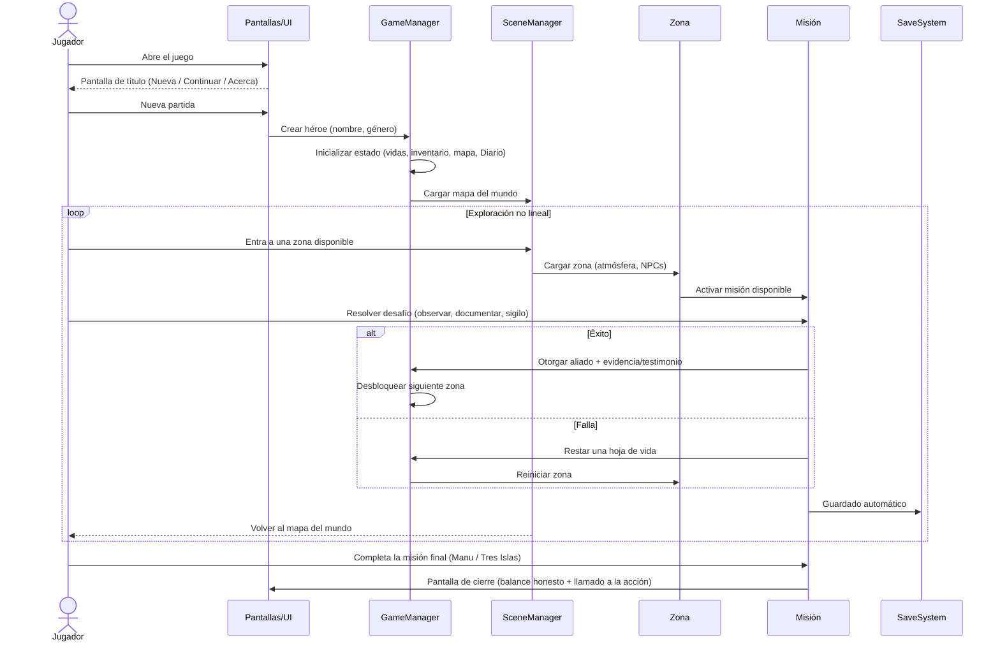
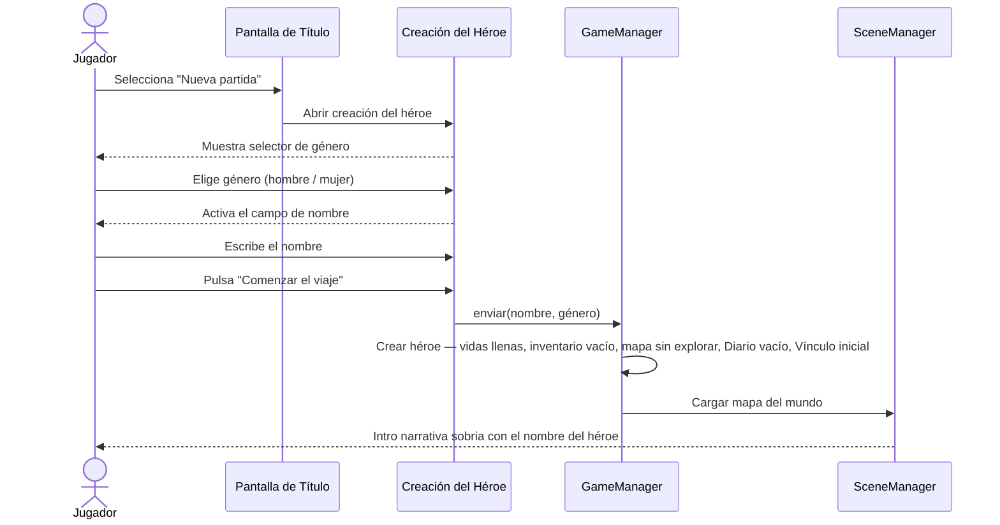
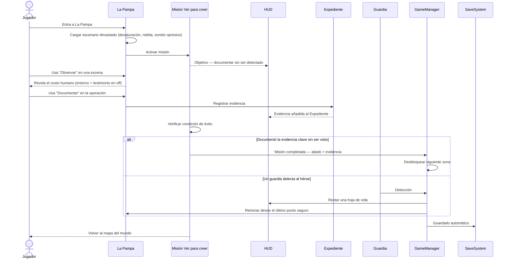

# Desierto de Oro — Documento de diseño del juego (GDD)
**Aventura retro estilo Zelda | Experiencia de concientización sobre la minería ilegal en Madre de Dios, Perú**

> *"Lo que el oro se llevó, tú puedes empezar a devolverlo. Pero nada vuelve igual."*

---

## ⚠️ Advertencia de contenido

*Desierto de Oro* no es un juego educativo para aula. Es una experiencia de concientización para **público adulto / maduro (16+)** que retrata, sin suavizarla, la realidad documentada de la minería ilegal en Madre de Dios: contaminación por mercurio, devastación del bosque, trata de personas y explotación sexual en torno a los campamentos, trabajo infantil y forzado, desplazamiento de comunidades y amenaza a pueblos en aislamiento voluntario.

Estos temas se tratan con **seriedad documental, nunca como espectáculo**. El horror se comunica por el entorno, el testimonio y las consecuencias — **nunca depictando** la violencia sobre víctimas, y jamás a menores. Ver la sección *Tratamiento de temas sensibles*.

---

## Concepto general

**Nombre del juego:** Desierto de Oro

**Género:** Aventura de acción top-down estilo Zelda clásico (SNES), con peso narrativo y de sigilo.

**Plataforma objetivo:** Móvil (Android / iOS) como app principal — desarrollo en **Godot 4.x**. Posible build web posterior.

**Propósito:** No "enseñar datos", sino **hacer sentir** lo que la minería ilegal le hace a una región viva y a su gente, para que el jugador no pueda mirar a otro lado. La concientización nace de la experiencia, no de la lección.

**Tagline:** *"Lo que el oro se llevó, tú puedes empezar a devolverlo. Pero nada vuelve igual."*

---

## Declaración de intención — el tono

El error que evitamos: convertir una tragedia humanitaria y ambiental en una infografía jugable. Recuadros de datos, quizzes y victorias limpias **distancian**. Aquí hacemos lo contrario.

**Principios de tono:**

1. **Mostrar, no explicar.** El jugador no lee "el mercurio envenena la cadena alimentaria": ve al pescador sacar el pez, ve a la familia comerlo, ve al niño temblar semanas después. El dato lo arma él solo.
2. **Crudo, pero no gratuito.** El daño se muestra sin filtro; la violencia explícita no. La fuerza está en lo que se insinúa y en las consecuencias, no en el morbo.
3. **Sin victoria limpia.** No hay un "100% restaurado". Hay zonas que vuelven, zonas que no, y gente que ya no está. El final es honesto: hay esperanza, pero tiene cicatrices.
4. **La gente no es víctima pasiva.** Las comunidades indígenas y ribereñas son las protagonistas de su propia defensa. El héroe acompaña; no salva solo.
5. **Basado en hechos.** Cada elemento duro corresponde a realidad documentada de Madre de Dios. Nada se exagera para impactar; la realidad ya impacta.

**Referentes de tono:** *This War of Mine* (la guerra desde el civil, no el soldado), *Papers, Please* (el sistema deshumaniza), *GRIS* / *Hollow Knight* (atmósfera 2D que comunica estado emocional sin texto).

---

## Alcance del proyecto

### Visión en una frase
Un viaje a pie por una Madre de Dios herida, donde cada zona es una etapa del duelo y de la resistencia, y donde el arma del héroe no es la espada sino **la mirada, el testimonio y la memoria**.

### Público objetivo
- Jóvenes y adultos **16+** (por temática, no por violencia gráfica).
- Peruanos —en especial de regiones amazónicas— y público internacional interesado en crisis socioambientales.
- Jugable y comprensible sin conocimientos previos del tema.

### Qué SÍ es
- Una aventura narrativa top-down corta e intensa (**45–75 min** por partida completa).
- Una experiencia de **inmersión emocional** con base documental real.
- Un retrato de un territorio y su gente, con realismo mágico contenido (Yaku).
- Un cierre con **llamado a la acción real** y enlaces a organizaciones que trabajan en la región.

### Qué NO es
- ❌ Un juego de quizzes o minijuegos educativos.
- ❌ Un shooter / hack-and-slash. El combate es mínimo y simbólico (sigilo, evasión).
- ❌ Una victoria de fantasía donde el héroe "derrota a la minería".
- ❌ Espectáculo del sufrimiento ajeno.

### Pilares de diseño
1. **Atmósfera por encima de mecánica.** El cómo se siente cada zona manda.
2. **Testimonio como núcleo**, no como coleccionable opcional.
3. **Consecuencia visible.** Lo que el jugador hace (o no logra) deja marca en el mundo.
4. **Realidad verificable.** Todo dato duro es trazable a una fuente real.

### Plataformas y duración
- **Principal:** Android / iOS (Godot 4.x, exportación nativa).
- **Secundaria (futuro):** Web (HTML5) y escritorio.
- **Duración objetivo:** 45–75 minutos, una sentada.
- **Guardado:** local en el dispositivo (`FileAccess` / `user://`).

### Etapas de construcción (alcance = juego completo, por fases)
El alcance acordado es el **juego completo** (6 zonas, 5 misiones principales). Para llegar allí sin ahogarnos, se construye por fases:

| Fase | Entregable | Objetivo |
|---|---|---|
| **0. Documentación** | Este GDD (✅ en curso) | Visión, tono y alcance cerrados |
| **1. Vertical slice** | Creación de héroe + Puerto Maldonado jugable + HUD + guardado | Probar la sensación y el tono con una zona completa |
| **2. Núcleo** | Motor de misiones, mapa del mundo, sistema de testimonios y aliados | Esqueleto jugable de punta a punta |
| **3. Contenido** | Las 6 zonas y 5 misiones principales con su atmósfera | Juego completo en contenido |
| **4. Pulido** | Arte final (Aseprite), audio (chiptune + sonido nativo), accesibilidad | Listo para difusión |

---

## Historia

Madre de Dios fue el pulmón verde del mundo: ríos cristalinos, bosques infinitos, comunidades en armonía con la selva. Hoy, franjas enteras son desiertos de arena y mercurio. No fue un desastre natural. Fue el oro.

El jugador elige a su héroe — hombre o mujer — y le da un nombre. Es un joven de la región que se fue a la ciudad años atrás y **regresa a su pueblo**. Lo que encuentra no se parece a su memoria: el río cambió de color, el bosque retrocedió, hay caras nuevas y caras que faltan. Nadie habla de más.

Guiado por **Yaku** —el espíritu de la selva, una anaconda ancestral que solo él alcanza a ver— el héroe recorre la región: de las zonas arrasadas a los últimos refugios vivos, juntando testimonios, memoria y aliados.

**No hay un jefe final que derrotar con violencia.** La "operación minera central" es una maquinaria de dinero, miedo y silencio. Vencerla significa **convocar a las comunidades, reunir la evidencia y romper el silencio** — y aun así, no todo se recupera. El héroe no salva la selva solo. Ayuda a que su gente recuerde que puede defenderla.

---

## Yaku — el marco simbólico (realismo mágico contenido)

Yaku no es magia de videojuego: es **cosmovisión amazónica real**. En las culturas del río, el agua y la serpiente son fuerzas vivas. Yaku encarna esa relación rota entre la gente y su territorio.

- Yaku **solo aparece para el héroe** y para quienes aún creen. En las zonas más muertas, casi no se manifiesta — su debilidad mide el daño.
- Sus "poderes" son contenidos y simbólicos: revelar un camino, calmar el agua un instante, hacer brotar vida donde la hubo. No resuelve el conflicto; **lo acompaña**.
- El resto del mundo —la minería, la enfermedad, la trata, la burocracia— es **crudamente real, sin un gramo de fantasía**.

Esta tensión es deliberada: lo espiritual sobrevive a duras penas dentro de un mundo brutalmente material.

---

## Personaje principal

### Creación del héroe
Al iniciar, el jugador ve una pantalla de creación:
- **Nombre:** texto libre (aparece en diálogos y HUD).
- **Género:** héroe masculino o femenino (sprite distinto, mismas capacidades).
- **Origen:** siempre de Madre de Dios — es parte de la narrativa, no opcional.

### Atributos
| Atributo | Descripción |
|---|---|
| **Vida** | Hojas de árbol (no corazones). Se pierden por daño, agotamiento o exposición tóxica. |
| **Conciencia** | Crece al recoger testimonios y presenciar la realidad. Desbloquea diálogos y comprensión, no "puntos". |
| **Vínculo natural** | Energía espiritual ligada a Yaku. Más fuerte en zonas vivas, casi nula en las muertas. |

### Habilidades (contenidas y narrativas)
- **Observar:** detenerse a mirar de verdad una escena contaminada o un rostro. Revela lo que el ojo apurado no ve. (Antes "Analizar" — ya no es un escáner de datos.)
- **Documentar:** la cámara es el arma central. Captar evidencia de daños, abusos y operaciones. Lo documentado **se acumula como prueba** y rompe silencios.
- **Convocar a Yaku:** invocar al espíritu para cruzar un río envenenado o revelar un camino oculto. Cuesta Vínculo y no siempre responde.
- **Sembrar:** plantar semillas sagradas en zonas recuperables. Restaura un fragmento — pequeño, real, no milagroso.

---

## Mapa del mundo

Representación estilizada de Madre de Dios, dividida en zonas con distintos grados de herida. Exploración no lineal, con zonas que se abren al avanzar la historia.

### Zonas

#### 1. Puerto Maldonado — La Ciudad Gris
- **Estado:** ciudad partida entre el "progreso" del oro y lo que el oro se llevó.
- **Visual:** mototaxis, polvo, anuncios de compra de oro, vegetación que resiste en los bordes.
- **Función:** zona de inicio. Aprender a moverse, observar y documentar. Primeros testimonios.
- **PNJ clave:** Doña Esperanza, anciana shipibo. No "explica la historia": la **recuerda en voz baja**, con lo que perdió.

#### 2. La Pampa — El Gran Desierto
- **Estado:** devastación total. La zona más oscura y perturbadora del juego.
- **Visual:** tierra arrasada hasta el horizonte, pozas de mercurio que reflejan el cielo como espejos muertos, maquinaria, campamentos. De noche, el neón frío de las **cantinas** alrededor de los campamentos.
- **Realidad cruda (referida, no exhibida):** La Pampa no es solo un crimen ambiental. Es un territorio sin Estado donde se documentan **trata de personas y explotación sexual de mujeres y adolescentes**, **trabajo infantil y forzado** en los pozos, violencia y desaparición. El jugador lo comprende por el entorno y los testimonios — nunca por una escena explícita.
- **Función:** corazón del conflicto. Infiltrarse y **documentar** la operación sin ser detectado.
- **Desafío:** sigilo entre guardias; la cámara como objetivo, no la pelea.
- **Realidad integrada:** la magnitud de hectáreas arrasadas; el mercurio; la economía del miedo.

#### 3. Río Madre de Dios — Las Aguas Envenenadas
- **Estado:** degradado, parcialmente vivo.
- **Visual:** agua amarillenta, dragas flotantes, orillas peladas, peces flotando.
- **Función:** navegación y rastreo del veneno río arriba.
- **Desafío:** moverse evitando dragas y zonas de mercurio; encontrar las nacientes aún limpias.
- **Realidad integrada:** el mercurio sube por la cadena alimentaria; se acumula en la sangre de comunidades aguas abajo — en mujeres gestantes y niños.

#### 4. Reserva Comunal Amarakaeri — El Último Bosque que Resiste
- **Estado:** protegido en el papel, amenazado en los hechos.
- **Visual:** bosque denso y vivo, comunidad Harakmbut, animales nativos. La frontera entre verde y desierto se ve a simple vista.
- **Función:** recuperación, alianza con la comunidad, habilidades ancestrales.
- **Desafío:** ayudar a la comunidad a demarcar y defender su territorio frente al avance.
- **PNJ clave:** Tato, joven Harakmbut, guardián del territorio.

#### 5. Parque Nacional del Manu — El Corazón Verde
- **Estado:** lo que queda intacto. El destino.
- **Visual:** biodiversidad máxima, color, guacamayos, nutrias gigantes, tapires. Contraste brutal con La Pampa.
- **Función:** zona final. No un "jefe": el **enfrentamiento es de evidencia y voces** contra la operación y su red de silencio.
- **Desafío final:** convocar a todos los aliados reunidos y presentar lo documentado. Detener una expansión — no toda la minería.
- **Amenaza latente:** los pueblos en **aislamiento voluntario** (PIACI) cuyo territorio el avance minero y maderero empuja al límite.

#### 6. Comunidad Nativa Tres Islas — La Resistencia
- **Estado:** en lucha legal y física.
- **Visual:** comunidad ribereña, botes, rostros determinados, asambleas.
- **Función:** zona de organización comunitaria.
- **Desafío:** coordinar con líderes para sostener una denuncia formal — la vía real por la que Tres Islas llevó su caso hasta las más altas cortes.

---

## Sistema de misiones

El juego usa misiones, no niveles. **Se eliminan los "minijuegos educativos" y los quizzes.** La comprensión emerge de vivir la historia.

### Misiones principales (hilo narrativo)
| # | Misión | Zona | Objetivo |
|---|---|---|---|
| 1 | El regreso | Puerto Maldonado | Volver al pueblo, aprender a observar y documentar, primer testimonio (Doña Esperanza) |
| 2 | Ver para creer | La Pampa | Infiltrar y documentar la operación y su costo humano, sin ser detectado |
| 3 | Agua que duele | Río Madre de Dios | Rastrear el mercurio río arriba hasta su fuente; presenciar a quién enferma |
| 4 | La línea del territorio | Amarakaeri | Ayudar a la comunidad a demarcar y defender su frontera |
| 5 | Romper el silencio | Parque del Manu / Tres Islas | Reunir aliados y evidencia; sostener la denuncia; cierre honesto |

### Misiones secundarias (profundidad humana)
Opcionales, pero son el alma del juego:
- **Recoger testimonios** de pobladores afectados — se guardan como **cartas/voces** en el Diario, con nombre y rostro.
- Ayudar a un animal herido a llegar a zona segura (y a veces no llegar a tiempo).
- Encontrar objetos culturales de comunidades desplazadas y devolverlos.
- Rastrear y documentar rutas clandestinas de mercurio y de oro.

### Cómo se comunica la realidad (en vez de quizzes)
- **Testimonio:** la gente cuenta, con sus palabras, lo que el dato resume.
- **Entorno:** el silencio donde había aves; el agua que cambió de color; la casa vacía.
- **Documentar:** lo que el jugador capta con la cámara **se vuelve la prueba** de la misión final. Aprender = mirar.
- **Antes / después:** flashes de la zona como era, sembrados en la memoria del héroe (y de Yaku).

---

## Mecánicas de juego

### Movimiento y exploración
- Vista top-down 2D estilo *Zelda: Link's Awakening / A Link to the Past*.
- El héroe camina, corre, observa, documenta e interactúa con objetos y PNJs.
- El mapa se revela al explorar.
- Zonas heridas con efectos: desaturación, niebla tóxica, sonido opresivo, Yaku debilitado.

### Combate (mínimo y simbólico)
El juego **rechaza la solución violenta**. Los "enemigos" son obstáculos, no personas a matar:
- **Guardias de la minera:** se evitan con sigilo. No se atacan.
- **Zonas tóxicas:** se cruzan con objetos (filtro de agua) o con Yaku.
- **El silencio y el miedo:** se vencen documentando y juntando voces, no con armas.

Esto **es** el mensaje: el problema no tiene salida violenta.

### Sistema de aliados
- A lo largo del viaje, el héroe suma aliados **con nombre, rostro y testimonio**.
- Cada aliado abre una posibilidad (un cruce, un acceso, una voz que faltaba).
- En el cierre, los aliados reunidos son la imagen del **poder colectivo** — la única fuerza que mueve algo.

### Objetos importantes
| Objeto | Descripción | Dónde |
|---|---|---|
| Cámara documental | Núcleo: documenta daños y abusos, construye la prueba | Puerto Maldonado |
| Semillas sagradas | Restaura fragmentos de zonas recuperables | Comunidad Amarakaeri |
| Mapa ancestral | Revela rutas ocultas en el bosque | Con Tato |
| Filtro de agua | Permite cruzar zonas de mercurio | Río Madre de Dios |
| Expediente | Acumula evidencia y testimonios para la denuncia final | Se construye durante el juego |

---

## Tratamiento de temas sensibles (responsabilidad)

Reglas de oro para todo el equipo de contenido:

1. **Nunca depictar** violencia sexual, abuso o explotación. Estos crímenes (incluida la trata y la explotación de menores) se comunican **solo** por entorno (el neón de una cantina, una puerta cerrada, música distorsionada), por **testimonio en off** o por **consecuencia** (una persona rescatada, una silla vacía). Jamás como escena ni como "contenido jugable".
2. **Menores: cero representación** en cualquier contexto de abuso. Su realidad se refiere por la voz de un adulto que la denuncia, nunca se muestra.
3. **Dignidad de las víctimas.** Nadie es decorado del horror. Cada persona tiene nombre, voz y agencia.
4. **Sin morbo.** Si una escena impacta por mostrar de más y no por lo que significa, está mal diseñada.
5. **Verificación.** Todo dato y situación se contrasta con fuentes reales (ver *Realidad documentada* y *Organizaciones*) antes del lanzamiento.
6. **Recursos de ayuda.** En menú y cierre, enlaces a líneas y organizaciones reales de denuncia y apoyo.

---

## Diseño visual e interfaz (UI)

### Dirección de Arte (Neo-Retro / Lo-Fi)
El videojuego evita el pixel art alegre y genérico habitual en juegos de rol tradicionales. En su lugar, utiliza un estilo **Neo-Retro / Lo-Fi** de tono sombrío, documental y melancólico, con las siguientes directrices:
- **Estética Degradada:** El pixel art debe verse texturizado, "sucio" y desgastado, reflejando el estado real de devastación de Madre de Dios.
- **Contraste y Luminancia:** Uso de contrastes fuertes. En zonas de minería (La Pampa), se contrapone un fondo oscuro y fangoso con destellos sintéticos (neones cian y magenta de las cantinas, y el brillo dorado del mercurio).
- **Filtro de Pantalla CRT:** Emulación de visualización en monitores antiguos mediante líneas de exploración (scanlines), efecto de brillo fósforo y viñeteado, lo que refuerza la sensación de estar revisando un archivo documental desclasificado o una cinta de vídeo analógica.
- **Narración por Color:** El color define la progresión del conflicto. El juego inicia en un Puerto Maldonado desaturado y polvoriento, desciende a la casi total monocromía de La Pampa (grises, marrones y el amarillo del mercurio), y culmina en la explosión cromática y viva del Parque del Manu si se logra proteger.

### Formato y orientación
- **Orientación:** horizontal (landscape), **bloqueada**. Es el estándar del género top-down y le da aire al mundo.
- **Lienzo base (pixel art):** **480 × 270 px** (16:9). Escala por enteros: ×4 = 1920×1080, nítido y sin desenfoque.
- **Escalado:** integer scaling con `aspect = keep`; nunca estirar de forma que rompa el pixel art.
- **Pantallas no-16:9** (notch, 19.5:9, 4:3): el área de juego se mantiene 16:9 centrada; los bordes extra se rellenan con HUD/atmósfera, nunca con UI crítica. Respetar **safe areas** (notch/gestos) con margen de ~24 px lógicos.
- **Tile base:** 16×16 (algunos objetos 32×32). A 480×270 el mundo muestra ~30×17 tiles: suficiente para explorar sin marear.
- **Godot:** `stretch/mode = canvas_items`, `aspect = keep`, `handheld/orientation = landscape`, viewport 480×270.

### Paleta de color (hex)
Paleta global de UI (constante en todo el juego):

| Rol | Hex | Uso |
|---|---|---|
| Fondo / overlay | `#14110E` | Fondos de menú, oscurecido |
| Panel | `#2A2520` | Cajas de diálogo, paneles |
| Borde / marco | `#C9A24B` | Marcos dorados (la ironía del oro) |
| Texto claro | `#EDE6D6` | Texto principal |
| Texto tenue | `#9A8F7A` | Secundario / deshabilitado |
| Acento oro | `#D9A521` | Resaltados, selección |
| Vida (hoja) | `#6FB23F` / vacío `#3A4A2A` | Hojas de vida |
| Vínculo (Yaku) | `#3FA7B2` | Barra de Vínculo Natural |
| Peligro / mercurio | `#C8B500` | Alertas, zonas tóxicas |

Paleta dominante por zona (tunable en Aseprite, máx. 16 colores por pantalla):

| Zona | Dominantes (hex) | Acento |
|---|---|---|
| Puerto Maldonado | `#B07D3A` `#6E4B2A` `#8A9A5B` | `#C9A24B` |
| La Pampa (día) | `#6B6862` `#3A2E22` `#A89A3C` | — |
| La Pampa (noche) | `#1B1F22` `#2A2E25` | neón `#2FB6C4` / `#C4356B` |
| Río Madre de Dios | `#B9A23E` `#7A4A2E` `#4A6A78` | `#9BC2C8` |
| Amarakaeri | `#2E7D3A` `#5AA9D6` `#B0623A` | `#E8C23A` |
| Parque del Manu | `#2FA84F` `#1E5A8A` | guacamayo `#D8453A` `#E8C23A` |

> El color **narra**: la saturación cae en zonas heridas y revive en las sanas. La Pampa es casi monocroma; el Manu estalla en color.

### Tipografía
- **UI / cuerpo:** **PixelOperator** (libre; incluye á é í ó ú ü ñ ¿ ¡). Alternativa: m6x11.
- **Títulos / logo:** PixelOperator Bold o una display pixel custom para el logo.
- Tamaños lógicos: cuerpo 8–10 px, títulos 16–24 px; interlineado generoso para legibilidad en móvil.
- **Innegociable:** soporte completo de tildes y ñ. Prueba: *"¿Qué dejó el oro? La peña ardió."*

### Sistema de componentes
Estilo común: panel `#2A2520` con borde dorado doble `#C9A24B` (biselado 16-bit de 1–2 px), esquinas rectas de ángulo recto, y una sombra dura arrojada (`#14110E`).

- **Caja de diálogo:** Franja inferior en panel retro; nombre del hablante en pestaña superior izquierda; retrato pixel-art 32×32 a la izquierda; avance interactivo por toque; indicador de avance `▸` con animación de rebote vertical continuo (micro-animación).
- **Panel de testimonio:** Modal centrado con bordes biselados reforzados y un sello verde (`#6FB23F`) de "Guardado en el Diario" que aparece con un sutil fade-in de 16-bit.
- **Toast de evidencia:** Notificación flotante superior con icono 📷 y texto en dorado que se desliza desde arriba con un retraso y rebote elástico.
- **Botones de menú e interactivos:** Lista vertical. El ítem seleccionado muestra un cursor indicador parpadeante `▸` en color `#D9A521` y un cambio de color del texto para guiar el foco de forma limpia.
- **Tooltip de zona bloqueada:** Globo de diálogo oscuro con un candado tembloroso y una pista tipográfica tenue sobre el prerrequisito.
- **Hojas de vida:** Iconos de hoja con animación de marchitado (se vuelven grises y caen) cuando el héroe es detectado o sufre daño.
- **Barra de Vínculo:** Indicador segmentado turquesa (`#3FA7B2`) que parpadea lentamente en zonas vivas para indicar una conexión fluida, y se apaga o muestra interferencia estática en zonas totalmente contaminadas.

### Controles táctiles (horizontal)
- **Abajo-izquierda — Joystick virtual:** 8 direcciones (o analógico); aparece bajo el pulgar, zona muerta configurable.
- **Abajo-derecha — Acciones:**
  - **A (grande):** acción contextual — interactuar / hablar / confirmar / observar el punto resaltado.
  - **B (mediano):** mantener para **correr**; en menús, cancelar / atrás.
  - **Habilidades (4):** Observar 👁 · Documentar 📷 · Convocar a Yaku 🐍 · Sembrar 🌱. En pantallas chicas se agrupan en una **rueda radial** que abre un botón ✦.
- **Arriba-derecha:** botón **☰** (menú / pausa).
- Soporte extra de **gamepad** y teclado (WASD/flechas + teclas de acción) para escritorio/web.
- Los controles se **ocultan** en diálogos y cinemáticas; reaparecen en juego.

### HUD (en juego)
- **Sup. izquierda:** nombre del héroe + hojas de vida; debajo, barra de Vínculo.
- **Sup. centro/derecha:** zona actual.
- **Sup. derecha (esquina):** botón ☰.
- **Inferior:** joystick (izq.) y acciones + habilidades + objeto equipado (der.).
- Evidencia/testimonio entran con **toast sobrio** (jamás recuadro de "dato curioso").

### Iconografía (set mínimo)
Hoja de vida (3 estados) · Vínculo · las 4 habilidades · objeto equipado · aliado · evidencia/foto · fragmento restaurado · candado (zona bloqueada) · misión activa · ☰ menú · marcador del héroe en el mapa.

---

## Diseño de sonido

### Música
- Chiptune 8/16-bit con instrumentos nativos amazónicos procesados (quena, zampoña).
- Cada zona tiene tema propio que refleja su estado: La Pampa, disonante y opresiva; el Manu, la pieza más rica — recompensa al llegar.
- Silencio como recurso: en las zonas más muertas, la música casi desaparece.

### Efectos
- Selva viva (aves, agua, viento) en zonas sanas; maquinaria, estática y generador en zonas mineras.
- Las voces de los aliados: frases breves en español; testimonios con peso.

---

## Pantallas del juego

Inventario completo de superficies de UI. Todas en **horizontal**. Las marcadas con ▢ tienen wireframe abajo.

| # | Pantalla | Tipo | Contenido clave |
|---|---|---|---|
| 1 | Splash / logo | Pantalla | Logo del estudio + advertencia 16+ |
| 2 | Título / menú principal ▢ | Pantalla | Nueva partida, Continuar, Acerca, Ajustes |
| 3 | Acerca del juego | Pantalla | Propósito, créditos, organizaciones reales |
| 4 | Ajustes | Pantalla | Audio, idioma, controles, accesibilidad |
| 5 | Creación del héroe ▢ | Pantalla | Género + nombre + intro |
| 6 | Intro narrativa | Cinemática | Texto sobrio con el nombre elegido |
| 7 | Mapa del mundo ▢ | Pantalla | Zonas (visitada/disponible/bloqueada), misiones, aliados, fragmentos |
| 8 | Juego / zona + HUD ▢ | Pantalla | Vista top-down + HUD + controles táctiles |
| 9 | Diálogo con NPC ▢ | Overlay | Caja inferior con nombre y retrato |
| 10 | Testimonio | Modal | Panel con retrato, lugar y voz; sello al Diario |
| 11 | Menú de pausa | Overlay | Reanudar, Diario, Expediente, Ajustes, Salir |
| 12 | Inventario / objetos | Pantalla | Objetos y objeto equipado |
| 13 | Diario / Testimonios ▢ | Pantalla | Memoria de lo visto (no enciclopedia escolar) |
| 14 | Expediente | Pantalla | Evidencia acumulada para la denuncia final |
| 15 | Reinicio de zona | Overlay | Al perder una hoja: "Te vieron. Inténtalo de nuevo." |
| 16 | Cierre ▢ | Pantalla | Balance honesto + llamado a la acción |

### Wireframes (referencia de layout, no arte final)

**2 · Título / menú principal**
```
┌────────────────────────────────────────────────┐
│             [ bosque  ◐  desierto ]              │
│                                                  │
│         D E S I E R T O   D E   O R O            │
│        "Lo que el oro se llevó…"                 │
│                                                  │
│              ▸ Nueva partida                     │
│                Continuar                         │
│                Acerca del juego                  │
│                Ajustes                           │
│                                            16+   │
└────────────────────────────────────────────────┘
```

**5 · Creación del héroe**
```
┌────────────────────────────────────────────────┐
│  CREA TU HÉROE                              ☰    │
│                                                  │
│   ┌──────┐    ┌──────┐     Nombre:               │
│   │  ♂  │    │  ♀  │     [______________]        │
│   └──────┘    └──────┘                           │
│   (sprite)    (sprite)                           │
│                                                  │
│  "Eres de Madre de Dios. Vuelves a casa."        │
│                          [ Comenzar el viaje ▸ ] │
└────────────────────────────────────────────────┘
```

**7 · Mapa del mundo**
```
┌────────────────────────────────────────────────┐
│ MADRE DE DIOS              Aliados: 2   🌱 x3    │
│                                                  │
│        (Manu)🔒          ╭── Amarakaeri ✓        │
│           │              │                       │
│    Río ~~~~~●────────  Pto. Maldonado ★          │
│           │              │                       │
│        La Pampa ❗──────  Tres Islas             │
│                                                  │
│  ★ aquí   ✓ visitada   ❗ misión   🔒 bloqueada   │
│                                  [ Entrar ▸ ]    │
└────────────────────────────────────────────────┘
```

**8 · Juego / zona + HUD + controles**
```
┌────────────────────────────────────────────────┐
│ NOMBRE 🌿🌿🌿           LA PAMPA            ☰    │  HUD sup.
│ Vínculo ▰▰▰▱▱                                    │
│                                                  │
│                · vista top-down ·                │
│                     (héroe)                      │
│                                                  │
│   ╭───╮                               👁  📷      │
│   │ ◉ │  joystick                     🐍  🌱      │
│   ╰───╯                            (B)   ( A )    │  controles
└────────────────────────────────────────────────┘
```

**9 · Diálogo con NPC**
```
┌────────────────────────────────────────────────┐
│                                                  │
│               (escena de juego)                  │
│ ┌──────────────────────────────────────────────┐│
│ │ Doña Esperanza                               ││
│ │ El río antes era azul. Ahora ni los peces    ││
│ │ se atreven a subir.                       ▸  ││
│ └──────────────────────────────────────────────┘│
└────────────────────────────────────────────────┘
```

**13 · Diario / Testimonios**
```
┌────────────────────────────────────────────────┐
│ DIARIO      [Testimonios] Lugares  Antes/Después │
│ ┌─────┬────────────────────────────────────────┐│
│ │ 👤  │ Doña Esperanza — Pto. Maldonado         ││
│ │ 👤  │ Tato — Amarakaeri                       ││
│ │ 🔒  │ ——— (aún no escuchado)                  ││
│ └─────┴────────────────────────────────────────┘│
│  "Lo que el héroe vio queda aquí."          ☰    │
└────────────────────────────────────────────────┘
```

**16 · Cierre**
```
┌────────────────────────────────────────────────┐
│   LO QUE LOGRASTE          LO QUE NO VOLVIÓ      │
│   Aliados:      5          Zonas perdidas:  2    │
│   Evidencia:    8          Personas que ya       │
│   Fragmentos:   4          no están…             │
│                                                  │
│  "Madre de Dios hoy: …"  (texto real y honesto)  │
│  Apoya: FENAMAD · SERNANP · CINCIA · DAR         │
│  [ Compartir la causa ]      [ Cómo ayudar ▸ ]   │
└────────────────────────────────────────────────┘
```

> **Cierre — sin victoria limpia:** muestra lo logrado (aliados con nombre, evidencia, fragmentos) **y lo que no se pudo salvar**; texto honesto sobre Madre de Dios hoy; llamado a la acción con organizaciones reales; "Compartir" para difundir la causa, no un puntaje. **Diario/Expediente:** la memoria de lo que el héroe vio y la prueba que sostiene la denuncia — el recurso que queda.

---

## Mensajes clave

1. La minería ilegal en Madre de Dios es una **crisis humanitaria**, no solo ambiental: golpea a comunidades, al agua, a la biodiversidad y a la dignidad de las personas.
2. Las comunidades locales son **guardianes**, no víctimas pasivas.
3. La salida es **colectiva**: comunidades, jóvenes, Estado y sociedad civil.
4. El bosque vivo vale —económica, cultural y ecológicamente— mucho más que el oro extraído.
5. Es urgente y grave, **pero no del todo irreversible**: hay zonas y personas que aún se pueden defender.

---

## Realidad documentada (datos verificados con fuente)

> **Para el equipo de prototipo / Claude Design:** esta es la base factual del juego. Cada dato debe aparecer **a través de la experiencia** (entorno, testimonio, consecuencia), **nunca como recuadro de quiz**. Las cifras provienen de estudios y prensa de investigación citados abajo.
>
> 📅 **Recopilado:** junio 2026. Las fuentes son de 2018–2026; varias citan estudios primarios (MAAP, CINCIA, Fiscalía de la Nación). **Re-verificar y fechar cada cifra antes del lanzamiento público.**

### 1. Deforestación y minería ilegal
- En ~20 años la minería ha devastado alrededor de **300,000 hectáreas** de bosque en Madre de Dios; más de **141,000 ha** se perdieron solo desde 2018. ([Rumbo Minero / MAAP, 2025](https://www.rumbominero.com/peru/noticias/mineria/madre-de-dios-perdio-6020-ha-por-mineria-ilegal-en-2024-segun-maap/))
- En **2024** la minería ilegal deforestó **6,020 ha** (una caída del 46% frente a 2023, pero el daño no se detiene). ([MAAP vía Rumbo Minero](https://www.rumbominero.com/peru/noticias/mineria/madre-de-dios-perdio-6020-ha-por-mineria-ilegal-en-2024-segun-maap/))
- El **36% de la minería aurífera** ocurre dentro de territorios indígenas o áreas naturales protegidas. ([Mongabay, 2023](https://es.mongabay.com/2023/11/peru-deforestacion-mineria-madre-de-dios-estudio/))
- Informe de referencia sobre la dimensión legal y de justicia: ([DAR, 2024 — *Desafiando la legalidad y la justicia*](https://dar.org.pe/wp-content/uploads/2024/08/Mineria-ilegal-en-Madre-de-Dios-version-final.pdf))

### 2. La Pampa y la Operación Mercurio
- **La Pampa** es la mayor zona de minería ilegal del departamento: entre los **Km 98 y 115 de la Carretera Interoceánica**, en la zona de amortiguamiento de la **Reserva Nacional Tambopata**. Sus primeros focos se detectaron hacia 2008 y alcanzó su pico en 2018.
- La **Operación Mercurio** inició el **19 de febrero de 2019** con **1,200 policías, 300 militares y 70 fiscales**. ([Mongabay, 2020](https://es.mongabay.com/2020/05/peru-futuro-de-la-operacion-mercurio/))
- Tras la intervención, la deforestación en La Pampa cayó **92%**: de **173 ha/mes** (ene 2017–feb 2019) a **14 ha/mes** (mar 2019–may 2020). ([MAAP](https://www.maapprogram.org/lapampa_opermercury/) · [Actualidad Ambiental](https://www.actualidadambiental.pe/maap-deforestacion-en-la-pampa-diminuye-en-92-tras-operativo-mercurio/))
- Pero la minería **no desapareció, se desplazó y resiste**: nuevos focos y violencia de los "Guardianes de la Trocha". ([Mongabay, 2026](https://es.mongabay.com/2026/02/mineria-ilegal-oro-la-pampa-guardianes-trocha-peru/))

### 3. Mercurio: crisis de salud pública
- El oro se separa con **mercurio**, que se evapora, cae en ríos y **sube por la cadena alimentaria** (agua → pez → persona). Se ha detectado en aire, agua, comida y personas. ([CINCIA](https://cincia.org/madre-de-dios-bajo-amenaza-estudios-evidencian-que-la-mineria-es-la-mayor-responsable-de-la-contaminacion-por-mercurio-2/) · [Infobae, 2025](https://www.infobae.com/peru/2025/06/23/crisis-ambiental-por-mineria-ilegal-descubren-niveles-alarmantes-de-mercurio-en-aire-agua-comida-y-personas-de-madre-de-dios/))
- En **Puerto Maldonado**, el **78% de los adultos** tenía mercurio en el cabello a niveles **3 veces** sobre el límite recomendado por la EPA. ([Mongabay, 2018](https://es.mongabay.com/2018/02/peru-mercurio-madre-de-dios-huancavelica-puno-cusco/))
- Las **mujeres en edad fértil** presentan los niveles más altos: el mercurio **cruza la placenta** y puede causar daño neurológico irreversible al feto. En comunidades como **Maizal** se hallaron niveles hasta **12 veces** sobre el límite.
- Las comunidades indígenas, que consumen más pescado, son las **más expuestas**.

### 4. Trata de personas y explotación sexual
- Entre **2020 y junio de 2025** la Fiscalía registró **804 casos** de trata (fines sexuales o laborales) en Madre de Dios — **3er lugar nacional** tras Lima y Piura, pese a ser una de las regiones menos pobladas. ([Convoca, 2025](https://convoca.pe/agenda-propia/madre-de-dios-trata-de-personas-crece-con-victimas-extranjeras-y-sentencias-sin))
- Solo en **2024** se reportaron **191 casos** (el **13.1%** del total nacional). ([Convoca, 2025](https://convoca.pe/agenda-propia/madre-de-dios-trata-de-personas-crece-con-victimas-extranjeras-y-sentencias-sin))
- Los rescates se concentran en **La Pampa, Laberinto, Infiernillo, Huepetue y Mazuko**; las víctimas son captadas en Puno, Cusco, Apurímac, Huánuco y Lima. ([Ojo Público](https://ojo-publico.com/1351/despues-de-la-pampa-los-nuevos-focos-de-la-trata-en-madre-de-dios) · [El Comercio](https://elcomercio.pe/peru/madre-de-dios/trata-personas-delito-conexo-mineria-ilegal-pampa-noticia-609007-noticia/))
- Cerca del **10%** de quienes fueron rescatadas en su niñez/adolescencia **regresan años después** al mismo entorno de explotación, por falta de oportunidades. ([Infobae, 2025](https://www.infobae.com/peru/2025/09/23/asediadas-por-la-mineria-ilegal-la-doble-exclusion-de-indigenas-sobrevivientes-de-la-trata-en-madre-de-dios/) · estudio de referencia: [Promsex](https://promsex.org/publicaciones/balance-sobre-la-situacion-actual-de-la-trata-explotacion-sexual-y-violencia-sexual-en-zonas-de-mineria-informal-de-madre-de-dios-y-piura/))

### 5. Economía: el espejismo del oro
- La minería explica **más del 50% del PBI regional**; cerca del **70%** de la economía gira en torno a ella. ([ComexPerú](https://www.comexperu.org.pe/en/articulo/madre-de-dios-cuando-el-crecimiento-economico-no-se-traduce-en-desarrollo))
- Hay unos **46,605 mineros artesanales**, pero el **90% de la actividad es ilegal o informal** (≈67% informal, 20% ilegal, solo 10% formal). ([ComexPerú](https://www.comexperu.org.pe/en/articulo/madre-de-dios-cuando-el-crecimiento-economico-no-se-traduce-en-desarrollo))
- Alternativas reales y sostenibles: la **castaña** (AFIMAD ya exporta a Corea del Sur, EE.UU., España y Alemania) y el **ecoturismo** (85% de la población cree que el turismo puede generar empleo). ([Rumbo Minero](https://www.rumbominero.com/peru/noticias/rse/economias-sostenibles-ganan-terreno-como-freno-a-la-mineria-ilegal/))

### 6. Biodiversidad: lo que está en juego
- Madre de Dios es llamada la **"Capital de la Biodiversidad del Perú"**.
- **Reserva Nacional Tambopata:** 648 especies de aves, ~1,000 de mariposas, 108 de mamíferos y 1,713 de flora. ([Infobae, 2023](https://www.infobae.com/peru/2023/09/05/madre-de-dios-alberga-la-reserva-nacional-tambopata-un-refugio-de-biodiversidad/))
- **Parque Nacional del Manu:** Patrimonio Natural de la Humanidad (UNESCO, 1987) y Reserva de Biósfera (1977); **1.7 millones de ha**; más de **1,000 aves** y **1,200 mariposas diurnas** (récord mundial), 155 anfibios y 132 reptiles. Es **0.01% de la superficie terrestre** pero alberga el **2.2% de los anfibios** y el **1.5% de los reptiles** del planeta. ([Patrimonio Mundial – Cultura](https://patrimoniomundial.cultura.pe/sitiosdelpatrimoniomundial/parque-nacional-del-manu) · [Andina](https://andina.pe/agencia/noticia-parque-nacional-del-manu-joya-conservacion-mundial-biodiversidad-cumple-49-anos-894888.aspx))

### 7. Comunidades indígenas y pueblos en aislamiento (PIACI)
- **Reserva Comunal Amarakaeri** (cogestionada por SERNANP, ECA Amarakaeri, FENAMAD y el consejo Harakbut–Yine–Matsiguenka): entre 2001 y 2023 perdió cerca de **20,000 ha** en su zona de amortiguamiento. ([MAAP #205](https://www.maapprogram.org/es/maap-205-situacion-actual-de-la-reserva-comunal-amarakaeri-amazonia-peruana/) · [Inforegión](https://inforegion.pe/reserva-comunal-amarakaeri-sufre-perdida-de-19-978-hectareas-de-bosque/))
- El **Rostro Harakbut**, sitio sagrado declarado **Patrimonio Cultural de la Nación (2021)**, está amenazado por minería y narcotráfico; líderes indígenas han sido amenazados y hasta secuestrados. ([Infobae, 2025](https://www.infobae.com/peru/2025/08/05/amenaza-al-patrimonio-cultural-la-mineria-y-el-narcotrafico-ponen-en-riesgo-al-rostro-harakbut-hoy-preservado-en-un-gemelo-digital/))
- El pueblo **Mashco Piro** —uno de los pueblos en aislamiento más numerosos del planeta— ve su territorio presionado por minería, tala, hidrocarburos y narcotráfico. **FENAMAD** llevó el caso ante la **Corte Interamericana de Derechos Humanos**. ([Mongabay, 2025](https://es.mongabay.com/2025/07/mashco-piro-peru-violacion-derechos-pueblos-aislamiento-corte-idh/) · [Infobae, 2024](https://www.infobae.com/peru/2024/10/29/territorios-invadidos-y-recursos-escasos-crecen-los-encuentros-entre-los-mashco-piro-en-aislamiento-y-comunidades-amazonicas/))

### 8. Marco legal: el REINFO y la formalización (la zona gris)
- El **REINFO** (Registro Integral de Formalización Minera), administrado por el **MINEM**, es un padrón de pequeña minería y minería artesanal. Estar inscrito **exime de responsabilidad penal por el delito de minería ilegal** mientras dure el proceso de formalización. ([gob.pe – MINEM](https://www.gob.pe/867-buscar-en-el-registro-integral-de-formalizacion-minera-reinfo) · [Infobae, 2024](https://www.infobae.com/peru/2024/11/29/que-es-el-reinfo-y-por-que-beneficia-la-mineria-ilegal/))
- Nació como mecanismo **transitorio**: el minero debía cumplir requisitos (RUC, declaración de producción, **IGAFOM** — instrumento de gestión ambiental para la formalización) vía la **Ventanilla Única de Formalización**. En la práctica, acumula años de prórrogas sin culminar.
- **Crítica central:** se ha convertido en un **"manto de impunidad"** — permite **camuflar y lavar oro de origen ilegal** y blinda a los inscritos frente a denuncias por contaminación. ([CooperAcción](https://cooperaccion.org.pe/el-chicle-se-sigue-estirando-congreso-aprueba-la-quinta-ampliacion-al-reinfo/) · [Infobae, 2024](https://www.infobae.com/peru/2024/11/29/que-es-el-reinfo-y-por-que-beneficia-la-mineria-ilegal/))
- **Quinta prórroga — Ley N° 32537 (dic. 2025):** extiende el REINFO hasta el **31 de diciembre de 2026**, o hasta que entre en vigor la nueva **Ley MAPE** (Pequeña Minería y Minería Artesanal), lo que ocurra primero. Se **descartó reincorporar a más de 50,000 mineros excluidos**. ([El Peruano](https://elperuano.pe/noticia/285952-promulgan-ley-que-amplia-vigencia-del-proceso-de-formalizacion-minera-integral-hasta-diciembre-de-2026) · [Infobae, 2025](https://www.infobae.com/peru/2025/12/17/reinfo-hasta-diciembre-de-2026-es-oficial-comision-permanente-aprueba-en-segunda-votacion-la-cuestionada-medida/))
- En Madre de Dios (prov. Manu), **44 inscritos en el REINFO siguen operando pese a investigaciones fiscales** por minería ilegal y contaminación; entre 2021–2023, **más de 5,800 inscritos** no presentaron sus reportes de producción de oro. ([IIMP / Rumbo Minero](https://www.rumbominero.com/actualidad/madre-de-dios-44-inscritos-en-el-reinfo-continuan-operando-pese-a-investigaciones-por-mineria-ilegal/))
- **Contexto 2026:** con los precios del oro altos, el IPE advierte que la prórroga puede incentivar más minería informal/ilegal si no se refuerza el control; y ninguno de los candidatos con opción de pasar a segunda vuelta plantea eliminar el REINFO. ([RPP](https://rpp.pe/economia/economia/mineria-ilegal-en-agenda-elecciones-2026-ninguno-de-los-candidatos-que-pasaria-a-segunda-vuelta-plantea-eliminar-el-reinfo-noticia-1687580))

> **Cómo entra en el juego:** el REINFO es el **telón de fondo sistémico** que explica por qué el héroe no puede "ganar" con una denuncia simple. Es la razón de que los guardias operen a plena luz, de que la burocracia sea un obstáculo real y de que el **Expediente** del jugador deba ser sólido para sostener la denuncia en **Tres Islas**. Refuerza el final honesto: el problema es **estructural, no un villano aislado**.

### Mapeo dato → zona (para el prototipo)
Qué realidad ancla cada zona del juego:

| Zona del juego | Dato real que la ancla |
|---|---|
| Puerto Maldonado | Economía del oro (>50% del PBI; 90% informal/ilegal); 78% de adultos con mercurio en cabello |
| La Pampa | ~300,000 ha arrasadas en 20 años; Operación Mercurio (−92%); 804 casos de trata (2020–2025) |
| Río Madre de Dios | Mercurio que sube por la cadena alimentaria; niveles hasta 12× en comunidades |
| Amarakaeri | ~20,000 ha perdidas (2001–2023); Rostro Harakbut; líderes amenazados |
| Parque del Manu | Récord mundial de biodiversidad; 0.01% del planeta, 2.2% de sus anfibios |
| Tres Islas / transversal | Pueblos en aislamiento (Mashco Piro) y litigio ante la Corte IDH |
| Burocracia / sistémico | El REINFO como "manto de impunidad"; 5ª prórroga hasta dic. 2026; futura Ley MAPE |

---

## Organizaciones reales (para el cierre y los créditos)

Para el llamado a la acción del final y los créditos. **Contactar y validar el vínculo con cada organización antes de enlazarlas públicamente.**

| Organización | Rol | Enlace |
|---|---|---|
| **FENAMAD** | Federación Nativa del Río Madre de Dios y Afluentes — defensa de pueblos indígenas y PIACI | fenamad.org.pe |
| **SERNANP** | Servicio Nacional de Áreas Naturales Protegidas (Manu, Tambopata, Amarakaeri) | gob.pe/sernanp |
| **CINCIA** | Centro de Innovación Científica Amazónica — ciencia del mercurio y restauración | cincia.org |
| **DAR** | Derecho, Ambiente y Recursos Naturales — incidencia legal y ambiental | dar.org.pe |
| **MAAP** | Monitoring of the Andean Amazon Project — monitoreo satelital | maapprogram.org |
| **Promsex** | Trabajo sobre trata y explotación sexual en zonas mineras | promsex.org |
| **Conservación Amazónica (ACCA)** | Economías sostenibles (castaña) y conservación | conservacionamazonica.org |

> Para denuncias de trata en Perú: **Línea 1818** (Mininter). Incluir recursos de ayuda en el menú y el cierre.

---

## Stack tecnológico

Desarrollo principal en **Godot 4.x**, exportación nativa Android / iOS.

### Por qué Godot
Motor open source, gratuito, fuerte en 2D y pixel art, exportación directa a móvil, comunidad hispana creciente y curva de aprendizaje accesible.

**Stack:**
- Motor: **Godot 4.x**
- Scripting: **GDScript**
- Render 2D: TileMap + Sprite2D + AnimationPlayer
- Exportación: Android APK / iOS IPA desde el editor
- Audio: AudioStreamPlayer (OGG / WAV)
- Guardado: `FileAccess` / `ResourceSaver` en `user://`
- UI: nodos Control sobre CanvasLayer (HUD, menús)

**Requerimientos mínimos:** Android 5.0 (API 21)+ / iOS 12+, 512 MB RAM, OpenGL ES 3.0 / Vulkan.

**Herramientas complementarias:** Aseprite (sprites/animación), Tiled (tilemaps), Audacity / LMMS (audio chiptune).

> Alternativas evaluadas y descartadas para esta etapa: Unity 2D (mayor curva, regalías sobre umbrales) y Flutter + Flame (menos maduro para esta escala). Godot queda como decisión.

### Estructura de archivos (Godot)
```
desierto_de_oro/
├── assets/
│   ├── sprites/          # personajes, tiles, objetos
│   ├── audio/            # música y efectos
│   ├── fonts/            # fuente pixel art en español
│   └── ui/               # iconos HUD, menús
├── scenes/
│   ├── world/            # mapa general y zonas
│   ├── ui/               # pantallas de menú, HUD, diario
│   ├── characters/       # héroe, PNJs, aliados
│   └── missions/         # lógica de cada misión
├── scripts/
│   ├── game_manager.gd   # estado global (singleton)
│   ├── hero.gd           # lógica del personaje
│   ├── map.gd            # navegación del mapa
│   └── mission.gd        # sistema de misiones
├── data/
│   ├── zones.json        # datos de cada zona
│   ├── missions.json     # configuración de misiones
│   ├── testimonios.json  # testimonios con nombre, voz y fuente
│   └── facts.json        # realidad documentada + fuente verificada
└── project.godot
```

---

## Diagramas de secuencia

> Estos diagramas definen los **pasos concretos** de cada flujo y sirven como especificación para la implementación en Godot. El set completo —mecánicas (Observar, Documentar, Yaku, Sembrar, Testimonio), sistemas transversales (sigilo, aliados, guardado) y progresión global— está en **[docs/diagramas-secuencia.md](docs/diagramas-secuencia.md)**.

### Diagrama 1 — Flujo general del juego



### Diagrama 2 — Creación del héroe



### Diagrama 3 — Misión "Ver para creer" (La Pampa)



---

## Changelog

- **v1.0** — Documento de diseño inicial (enfoque web / educativo).
- **v2.0** — Stack móvil (Godot) y diagramas de secuencia.
- **v3.0** — Replanteo de **visión y alcance**: de juego educativo → **experiencia de concientización cruda y honesta**. Tono crudo y sin filtros (16+), realismo mágico contenido (Yaku se mantiene, el mundo es real), eliminación de minijuegos/quizzes didácticos, testimonios como núcleo, final sin "victoria limpia", sección de tratamiento responsable de temas sensibles, y definición explícita de alcance por fases.
- **v3.1** — **Datos reales investigados y documentados con fuente** (deforestación, Operación Mercurio, mercurio, trata, economía, biodiversidad, PIACI, **marco legal REINFO / Ley MAPE**), mapeo dato→zona y lista de organizaciones — base factual para el prototipo en Claude Design. Diagramas de secuencia migrados a **Mermaid** (set completo en `docs/diagramas-secuencia.md`).
- **v3.2** — **Especificación de interfaz (UI) completa**: formato horizontal (480×270, 16:9), controles táctiles, sistema de diseño (paleta hex, tipografía, componentes), inventario de 16 pantallas y wireframes ASCII.
- **v4.0 Alpha** — *(este documento)* **Desarrollo Inicial en Godot 4**:
  - Inicialización del proyecto de Godot 4.
  - Creación de singletons Autoload (`GameManager` para estado global y `SceneManager` para transiciones con fundido).
  - Implementación de Menú Principal (con fondo texturizado) y Creación de Héroe (con selección de género interactiva y renders SVG pixel-art).
  - Implementación de la escena de navegación del Mapa del Mundo y del marcador de posición de Zona.

---

*GDD v4.0 Alpha — Para desarrollo con Godot 4.x | Android e iOS*
*Proyecto de concientización — minería ilegal, Madre de Dios, Perú*

