# Desierto de Oro — Diagramas de secuencia (especificación de flujos)

Este documento define los **pasos concretos** de cada flujo del juego. Funciona como **especificación de implementación**: cada participante mapea a un sistema/nodo previsto en Godot, y cada diagrama describe el comportamiento esperado paso a paso.

Complementa al GDD (`README.md`). Los 3 flujos de alto nivel (general, creación del héroe, misión insignia) viven en el README; aquí están las **mecánicas**, los **sistemas transversales** y la **progresión global**.

> Los diagramas usan sintaxis Mermaid (se renderizan en GitHub y en la mayoría de visores Markdown).

---

## Convención de participantes

Cada actor de los diagramas corresponde a una pieza del proyecto Godot:

| Participante | Rol | Implementación prevista (Godot 4.x) |
|---|---|---|
| **Jugador** | Persona que juega | Input |
| **GameManager** | Estado global, atributos y reglas | Autoload (singleton) |
| **SceneManager** | Transiciones entre escenas | Autoload (singleton) |
| **Pantallas/UI** | Título, creación, menús | Escenas `Control` en `CanvasLayer` |
| **HUD** | Interfaz durante el juego | `CanvasLayer` |
| **Heroe** | Personaje jugable | `CharacterBody2D` |
| **Zona** | Escena de cada zona del mapa | `Node2D` + `TileMap` |
| **Misión** | Lógica de objetivos | Recurso/escena en `missions/` |
| **Expediente** | Evidencia documentada (prueba) | Datos en `GameManager` |
| **Diario** | Testimonios y memoria | Datos en `GameManager` |
| **Yaku** | Espíritu guía (realismo mágico) | Escena + `AnimationPlayer` |
| **Aliado** | Personaje que se suma al viaje | Escena en `characters/` |
| **Guardia** | Antagonista de sigilo | `CharacterBody2D` + cono de visión |
| **SaveSystem** | Guardado / carga | `FileAccess` en `user://` |
| **AudioManager** | Música y efectos | Autoload + `AudioStreamPlayer` |

---

## A. Flujos de sistema (alto nivel)

> El flujo general, la creación del héroe y la misión insignia están en el README. Aquí, el flujo de exploración del mapa y el cierre.

### A1 — Exploración del mapa del mundo (selección de zona)

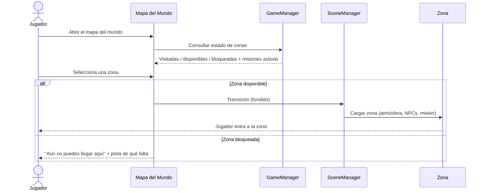

### A2 — Cierre del juego (balance honesto, sin victoria limpia)

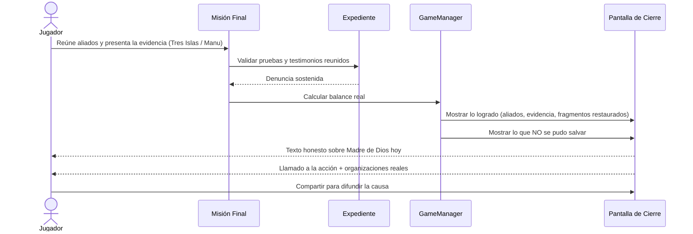

---

## B. Mecánicas / habilidades del héroe

### B1 — Observar

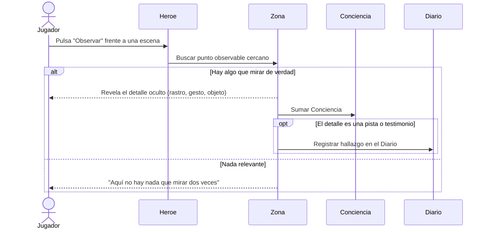

### B2 — Documentar (la cámara construye la prueba)

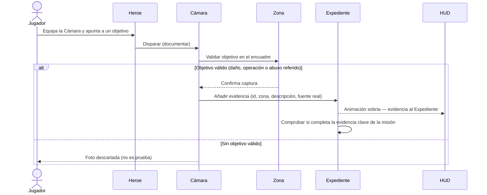

### B3 — Convocar a Yaku (cruzar río envenenado / revelar camino)

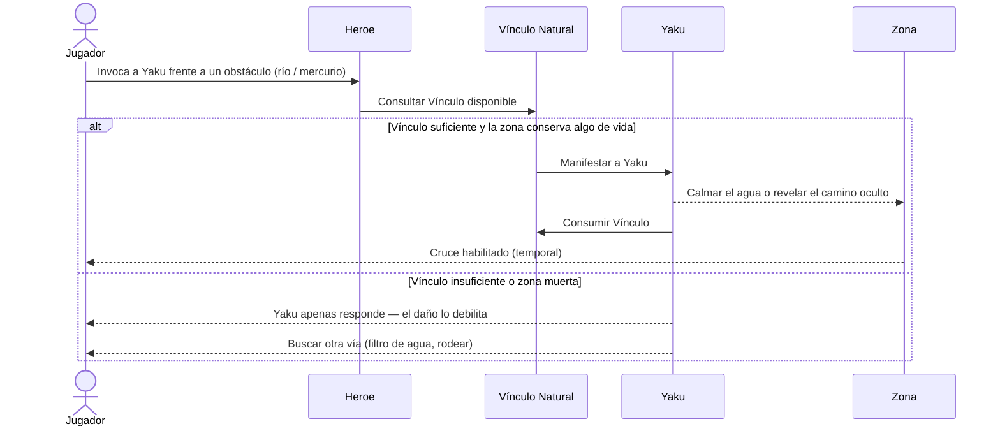

### B4 — Sembrar (restaurar un fragmento real, no milagroso)

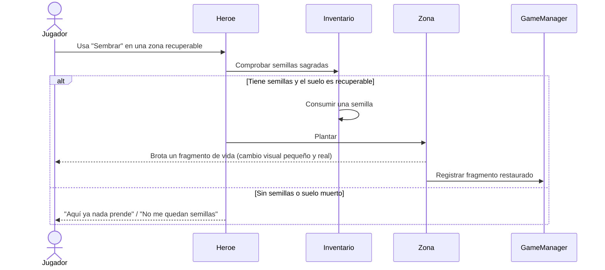

### B5 — Recoger testimonio (núcleo emocional)

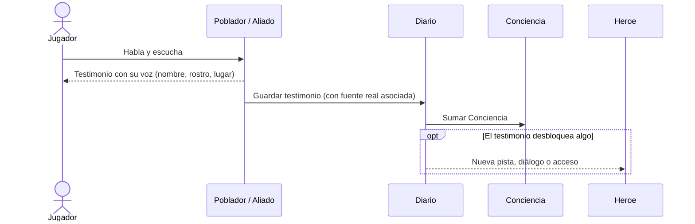

---

## C. Sistemas transversales

### C1 — Sigilo y detección

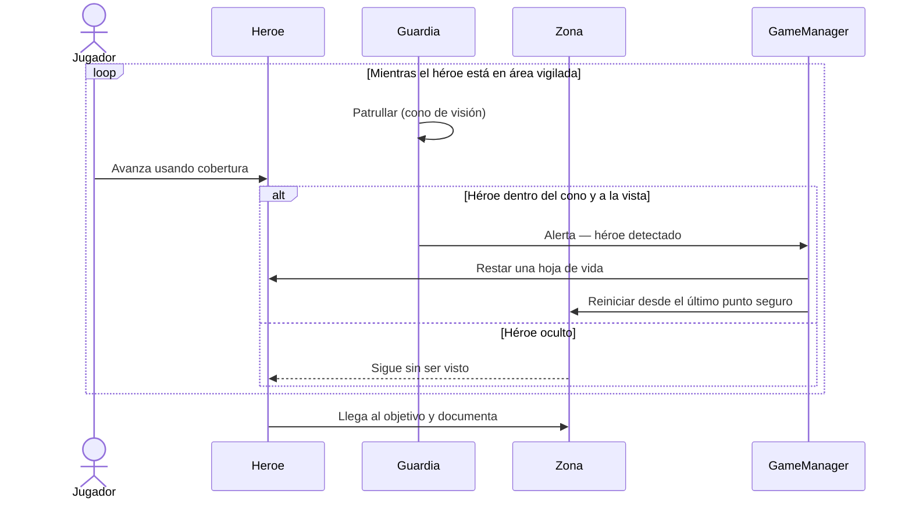

### C2 — Sistema de aliados

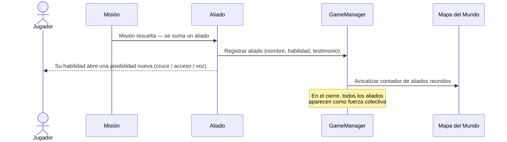

### C3 — Guardado automático y Continuar

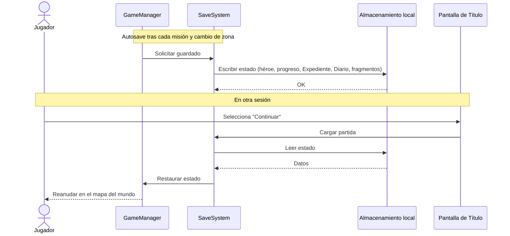

---

## D. Visión de conjunto — progresión global

Diagrama de estados que resume la ruta completa: pantallas, zonas y misiones principales. La exploración es **no lineal**; Tres Islas es zona de apoyo accesible en paralelo.

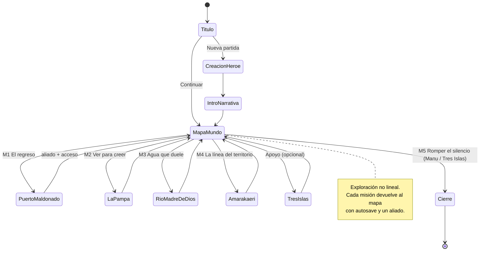

---

*Documento de flujos v1.0 — acompaña al GDD v3.0. Para implementación en Godot 4.x.*
